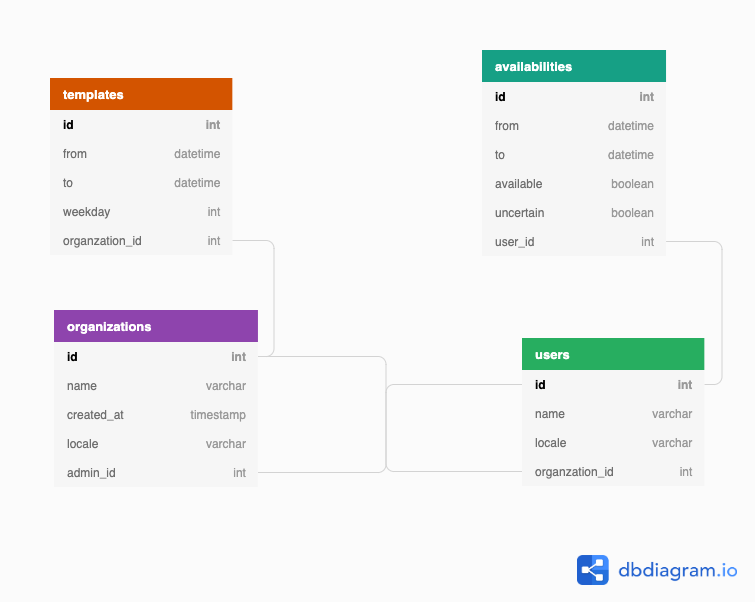

# Models for Vacancy

## Database

### Organization

| field        | type       | description                                                                          |
| ------------ | ---------- | ------------------------------------------------------------------------------------ |
| `id`         | `int`      | just an unique identifier                                                            |
| `name`       | `varchar`  | displayed organization name                                                          |
| `locale`     | `varchar`  | default locale setting for users belonging to organization (language code [PL, ENG]) |
| `admin_id`   | `int`      | id of user who has administrative privileges of an organization                      |
| `created_at` | `datetime` | organization creation timestamp                                                      |

### Template

| field             | type       | description                                                    |
| ----------------- | ---------- | -------------------------------------------------------------- |
| `id`              | `int`      | just an unique identifier                                      |
| `from`            | `datetime` | start hour (and date that doesn't matter) of template          |
| `to`              | `datetime` | end hour (and date that doesn't matter) of template            |
| `weekday`         | `int`      | counting from Monday (as 1), day of a week template belongs to |
| `organization_id` | `int`      | organization that template belongs to                          |
| `created_at`      | `datetime` | template creation timestamp                                    |

### User

| field             | type       | description                           |
| ----------------- | ---------- | ------------------------------------- |
| `id`              | `int`      | just an unique identifier             |
| `name`            | `varchar`  | displayed organization name           |
| `locale`          | `varchar`  | user locale (language code [PL, ENG]) |
| `organization_id` | `int`      | organization that user belongs to     |
| `created_at`      | `datetime` | user creation timestamp               |

### Availability

| field        | type       | description                                                |
| ------------ | ---------- | ---------------------------------------------------------- |
| `id`         | `int`      | just an unique identifier                                  |
| `from`       | `datetime` | start hour (and date that doesn't matter) of availability  |
| `to`         | `datetime` | end hour (and date that doesn't matter) of availability    |
| `available`  | `boolean`  | indicates whenever user is available at given time range   |
| `uncertain`  | `boolean`  | indicates that user is not yet sure about given time range |
| `created_at` | `datetime` | availability creation timestamp                            |

## GraphQL

- getMyStuff (better name)?
  - team
  - mapped
  - overview
- createTemplate
- createAvailability
